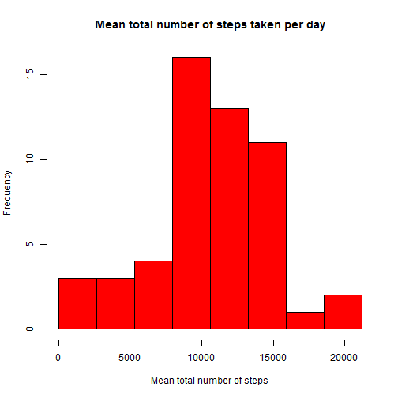
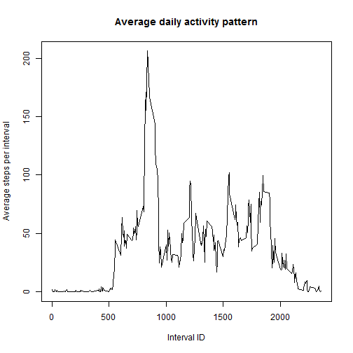
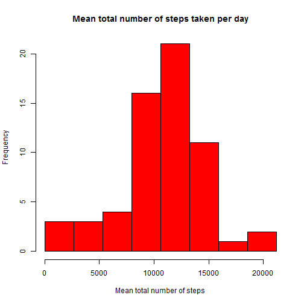
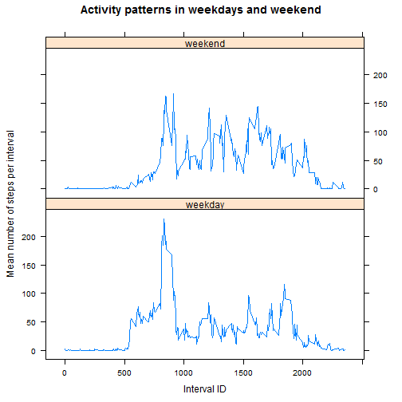

Reproducible Research: Assignment 1
===================================

This is the solution to assignment 1 for Coursera Reproducible Research class (June, 1, 2015 - June, 28, 2015)

The analysis was produced with this software environment:

```r
sessionInfo()
```

```
## R version 3.1.2 (2014-10-31)
## Platform: x86_64-w64-mingw32/x64 (64-bit)
## 
## locale:
## [1] LC_COLLATE=English_United States.1252 
## [2] LC_CTYPE=English_United States.1252   
## [3] LC_MONETARY=English_United States.1252
## [4] LC_NUMERIC=C                          
## [5] LC_TIME=English_United States.1252    
## 
## attached base packages:
## [1] stats     graphics  grDevices utils     datasets  methods   base     
## 
## other attached packages:
## [1] lattice_0.20-29 plyr_1.8.1      knitr_1.10.5   
## 
## loaded via a namespace (and not attached):
##  [1] digest_0.6.8    evaluate_0.7    formatR_1.2     grid_3.1.2     
##  [5] htmltools_0.2.6 markdown_0.7.4  mime_0.2        Rcpp_0.11.5    
##  [9] rmarkdown_0.5.1 stringr_0.6.2   tools_3.1.2
```

##1. Loading and preprocessing data.  
### Loading data

Create sub-directory "data" in the working directory to store the downloaded raw data file:

```r
if (!file.exists("data")){
    dir.create("data")
} 
```

Download the raw data file in the 'data' directory.

```r
fileUrl <- "http://d396qusza40orc.cloudfront.net/repdata%2Fdata%2Factivity.zip"
download.file(fileUrl, destfile = "./data/repdata-data-activity.zip") 
dateDownloaded <- date()
```
The file was downloaded on Sat Jun 13 23:38:51 2015.  
Unzip the file in the same directory:

```r
unzip("./data/repdata-data-activity.zip", exdir = "./data")
```

Read the file into dataframe *activity* in R

```r
activity <- read.csv("./data/activity.csv")
```


### Examining data  
Examine the data set by running the following summaries:


```r
names(activity)
```

```
## [1] "steps"    "date"     "interval"
```

```r
str(activity)
```

```
## 'data.frame':	17568 obs. of  3 variables:
##  $ steps   : int  NA NA NA NA NA NA NA NA NA NA ...
##  $ date    : Factor w/ 61 levels "2012-10-01","2012-10-02",..: 1 1 1 1 1 1 1 1 1 1 ...
##  $ interval: int  0 5 10 15 20 25 30 35 40 45 ...
```

```r
summary(activity)
```

```
##      steps                date          interval     
##  Min.   :  0.00   2012-10-01:  288   Min.   :   0.0  
##  1st Qu.:  0.00   2012-10-02:  288   1st Qu.: 588.8  
##  Median :  0.00   2012-10-03:  288   Median :1177.5  
##  Mean   : 37.38   2012-10-04:  288   Mean   :1177.5  
##  3rd Qu.: 12.00   2012-10-05:  288   3rd Qu.:1766.2  
##  Max.   :806.00   2012-10-06:  288   Max.   :2355.0  
##  NA's   :2304     (Other)   :15840
```

```r
head(activity)
```

```
##   steps       date interval
## 1    NA 2012-10-01        0
## 2    NA 2012-10-01        5
## 3    NA 2012-10-01       10
## 4    NA 2012-10-01       15
## 5    NA 2012-10-01       20
## 6    NA 2012-10-01       25
```

Here some observational facts about the data set:  
1. There are 3 variables (columns) and 17586 observations.  
2. Each day has 288 periods.  
3. There are records for 61 days, two months (October and November).  
4. The periods are 5 minutes long: 288*5 = 1440 minutes -> 24 hours.  
5. The indexing of the periods is not continuous, every hour starts new hundreds.  
&nbsp;&nbsp;&nbsp;&nbsp;&nbsp;&nbsp;example: 0, 5,, 10, ...55 - periods for the first hour  
&nbsp;&nbsp;&nbsp;&nbsp;&nbsp;&nbsp;100, 105......155 -> periods for the next hour.   
&nbsp;&nbsp;&nbsp;&nbsp;&nbsp;&nbsp;that's way the period index runs to 2355 instead being 1440.    
6. There are 2304 NA entries, which corresponds to 8 complete days.  
7. There are days that all the values are NA and days that all the values are non-NA, there are not days that have values in some periods and NA in others.


We compute which days have NA entries.  
indexNA has the indices of all NA entries *steps* column. There are 288 periods in a day.


```r
indexNA <- which(is.na(activity$steps))
v <- seq(1:(length(indexNA)/288)) #number of days with NA
days <-indexNA[v*288]/288 
```
The days that are missing values are: 1, 8, 32, 35, 40, 41, 45, 61

###Preprocessing data

1. There are 2304 rows with NA values. We can remove them but since the assignment later on asks us to replace them I am going to leave it as it is. I will remove them only for the parts of the assignment that lets us ignore them.
2. The variable *date* is a factor. It makes more sense to be in date format. It will be useful to later on to figure out which days are weekdays and which are weekend days.


```r
activity$date <- as.Date(activity$dat, "%Y-%m-%d")
class(activity$date)
```

```
## [1] "Date"
```


##2. What is mean total number of steps taken per day?

We can ignore the NA in the summaries we are going to do but they will be replaced with 0 and will affect the counts in the first bar of the histogram. That's way I will remove them with complet.cases command:

```r
activityCC <- activity[complete.cases(activity),]
```

I will use *plyr* package to summarize the data set (to calculate the sum of all steps per day).


```r
library(plyr)
activityCCday <-ddply(activityCC, c("date"), summarize, summ = sum(steps, na.rm = TRUE))
mn <- mean(activityCCday$summ)
md <-median(activityCCday$summ)
```

We use the base plotting system in R to make the histogram.


```r
hist(activityCCday$summ, xlab = "Mean total number of steps",  breaks = seq(0, 22000, by = 2650),
     main = "Mean total number of steps taken per day", col = "red")
```

 

The mean of the total number of steps taken per day is 10766.19 and the median is 10765


##3. What is the average daily activity pattern?

Again use the *ddply* function to summarize, this time by "interval" and then take the mean.


```r
activityInterval <- ddply(activityCC, c("interval"), summarize, meann = mean(steps, na.rm = TRUE))
```

We use the base plotting system in R to make the series plot.

```r
plot(activityInterval$interval, activityInterval$meann, type = "l",
     xlab = "Interval ID", ylab = "Average steps per interval",
     main = "Average daily activity pattern" )
```

 

```r
m <- max(activityInterval$meann)
id <- activityInterval$interval[which(activityInterval$meann == m)]
```
The 5-minute interval with maximum average number of steps is 835 and the average number of steps is 206.1698113. If we assume that all days start at 12 am, then this period corresponds to 8:35 am. 

##4. Imputing missing values

We will replace the missing values with the mean steps calculated for this period from the other days.  
The means were calculated in task 2 and stored in *activityInterval\$meann*. This column has 288 elements.    
We will use the structure of missing values - days have either all NAs or all meaningfull values.   
A new variable, *activity\$stepsRMna* is created and initially populate with the values from *activity\$steps*.     
The indices of the NA entries are found and *activity\$stepsRMna* is subseted with this indices and assigned to the *activityInterval\$meann*. This strategy works because the NAs fill full days and R recycling rules. 


```r
totalNA = sum(is.na(activity$steps))#total number of NAs
index <- which(is.na(activity$steps))#the indecies of all NAs
activity$stepsRMna <- activity$steps #make a column that is going to store the steps with NAs removed
activity$stepsRMna[index] <- activityInterval$meann #replace the NA with the mean for that period

activityNew <- activity[,2:4] #make new data frame with steps column replaced with the column with MA removed
names(activityNew)[3] <- "steps" #rename back to steps
```
*actiityNew* is the new data set equivalent to the original one but with NAs removed.

Now, repeat the "mean total number of steps" analysis for the new data set.

```r
library(plyr)
activityNewDay <-ddply(activityNew, c("date"), summarize, summ = sum(steps, na.rm = TRUE))
mnn <- mean(activityNewDay$summ, na.rm = TRUE)
mdn <- median(activityNewDay$summ, na.rm = TRUE)
```

Use the base plotting system to make the histogram.


```r
hist(activityNewDay$summ, xlab = "Mean total number of steps",  breaks = seq(0, 22000, by = 2650),
     main = "Mean total number of steps taken per day", col = "red")
```

 

```r
max(activityNewDay$summ)
```

```
## [1] 21194
```

The mean of the total number of steps taken per day is 10766.19 and the median is 10766.19
The replacement of NA values made almost no difference. The reason is that we replaced the NA with the mean for the period. If we executed different strategy for NA replacement that would result in more significant difference.    
Total daily number of steps of the days that did not have NAs is not affected by the filling of NAs. Obviously, the total number of steps for the days that had originally NAs is different. If there were days with NAs and real values, then filling the NAs would result in increase of the total number of steps taken in these days. 


##5. Are there differences in activity patterns between weekdays and weekends?

We start with making a new column that shows the week day for each date:

```r
activityNew$week <- weekdays(activityNew$date)
```

Next we index all days with 0 or 1 depending on if they are weekdays or weekend days, cast the logical index as a factor and change "false/true" levels to "weekday/weekend" ones.

```r
lindex <- activityNew$week == "Sunday" | activityNew$week == "Saturday"
lindexFac <- as.factor(lindex)
levels(lindexFac) <- c("weekday", "weekend")
```

Attache the factor vector as column to the data frame.

```r
activityNew$weekdays <- lindexFac
```

Summarize the data by 'weekdays' and 'interval' using *ddply* command from *dply* package

```r
activityNewSummary <- ddply(activityNew, c("weekdays", "interval"), summarize, meann = mean(steps))
```

Use the lattice plotting system in R to make the plots using 'weekdays' variable as conditional.

```r
library(lattice)
xyplot(meann ~ interval| weekdays, data = activityNewSummary, type = "l", layout = c(1,2),
       xlab = "Interval ID", ylab = "Mean number of steps per interval", main = "Activity patterns in weekdays and weekend")
```

 

Here is that we can conclude from these graphs. In the weekend, people sleep until a little late, the mean steps number started to pick up slow at the period with ID '500'. Later, they have physical activities (walking, running, playing sports, etc), the mean step number of the periods between 10000 and 20000 is higher than the same periods of weekdays. In the weekend, people go to bed a little later, the activity after period 2000 dies faster in the weekdays.


